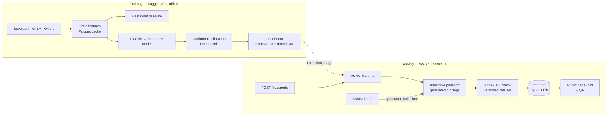

# batteriepass

Estimates the state of health of a lithium-ion cell from its early cycling data,
assembles a Catena-X-conformant battery passport around that estimate, checks the
result against the attributes Annex XIII of Regulation (EU) 2023/1542 actually
mandates, and serves it at a public QR-addressable URL.

From 18 February 2027, EV batteries, industrial batteries above 2 kWh and
light-means-of-transport batteries placed on the EU market must carry a digital
passport. Annex XIII splits its contents into static fields — chemistry,
manufacturing site — and **dynamic** fields specific to the individual cell, of which
state of health is one. State of health cannot be measured directly. It has to be
estimated. Remove the model and the passport is non-compliant.

> **This is not a certified measurement.** The state-of-health figure is a statistical
> estimate from a research model trained on laboratory cycling data, and it ships with
> a calibrated interval saying how much to trust it. It is not type-approved and must
> not be used for a safety, warranty or resale decision. See
> [`models/model_card.md`](models/model_card.md).

---

## Results

Every number here comes from a real run on a cell-disjoint split. An empty cell means
not yet measured, and stays empty until it is. Nothing in this table is an estimate of
what the number will be.

### State of health

| | Test error (MAPE) | 90% interval, empirical coverage |
|---|---|---|
| Published baseline — Severson et al., *Nature Energy* 2019 | 9.1% | — |
| Elastic net on ΔQ(V) features, reproduction | | |
| 1D CNN over voltage–capacity curves | | |
| Sequence model over per-cycle features | | |

Errors are mean ± standard deviation across fixed seeds. One run is an anecdote.

### Cross-dataset transfer

Trained on Severson, tested on chemistries and protocols the model has never seen.
Each transfer set is used as a test set exactly once and never tuned on.

| Test set | Chemistry | Test error | Interval coverage |
|---|---|---|---|
| Severson, held out | LFP, fast charge, 30 °C | | |
| NASA PCoE | | | |
| Oxford Battery Degradation | | | |

The gap between the first row and the others is the honest headline. Cross-chemistry
generalisation is the open problem in this field, and reporting the drop is the
difference between this and a notebook.

### Conformance and service

| Metric | Value |
|---|---|
| Annex XIII attributes checked, all seven clusters | |
| ONNX vs PyTorch, max abs difference | |
| Passport assembly incl. inference, p50 / p95 | |
| Cold start to first response | |

---

## How it works



Two programs, one artefact. Training needs PyTorch and a GPU. Serving needs ONNX
Runtime and a CPU. The only thing that crosses between them is a `.onnx` file, and CI
fails the build if `torch` ever appears under `src/`. The reason is cold start: a
CPU-only torch install is roughly 700 MB against onnxruntime's 50 MB.

## Layout

| Path | Owns |
|---|---|
| `src/bpass/core/` | The domain contract. Depends on nothing, strict-typed |
| `src/bpass/samm/` | SAMM Turtle → Pydantic generator. Knows RDF, not batteries |
| `src/bpass/bindings/` | Generated aspect-model bindings. Committed, never hand-edited |
| `src/bpass/conform/` | Annex XIII rule sets and per-cluster checks |
| `src/bpass/data/` | Dataset loaders, feature extraction, split manifests |
| `src/bpass/inference/` | ONNX session, preprocessing, prediction |
| `src/bpass/passport/` | Assembly, provenance, the record store |
| `src/bpass/api/` | FastAPI routes. Transport only |
| `training/` | The only place `torch` is imported |
| `rulesets/annex-xiii/` | Versioned rule data, hashed |
| `manifests/` | Committed cell-disjoint split manifests |
| `docs/adr/` | Why things are the way they are |

## Local development

```bash
uv sync --all-extras
uv run pytest
uv run python scripts/no_torch_in_src.py
```

Training has its own environment, because it is the one place torch is allowed. It is a
plain requirements file so that torch can never enter `uv.lock`, and so a Kaggle
notebook can install it in one line:

```bash
pip install -r training/requirements.txt
uv run python training/baseline.py --split manifests/severson-v1.json
```

## Non-negotiables

These are enforced by tests and CI, not by intention.

1. **`src/` never imports `torch`,** and torch never appears in the runtime
   dependency list. `scripts/no_torch_in_src.py` fails the build otherwise.
2. **`src/bpass/bindings/` is generated and never hand-edited.** CI regenerates and
   fails on any diff.
3. **Rule sets are versioned data, never constants.** Every record carries
   `ruleset_version` and `ruleset_sha256`.
4. **Every record carries `model_sha256`.** Which bytes produced this number is a
   question an auditor asks and a training-run id cannot answer.
5. **Split by cell, never by cycle,** and commit the split manifest. Cycles from one
   cell appearing in both train and test is the classic invalidating error in this
   literature.
6. **Respect the observation window.** Predicting from the first 100 cycles means no
   feature touches cycle 101 or later, normalisation statistics included.
7. **Transfer sets are test sets exactly once.** Never tuned on.
8. **Never claim certification.** The service checks against a published reading of
   Annex XIII. That sentence is true; the other one is not.
9. **Every number in this README comes from a real run.** An empty cell is correct
   until measured.

## Out of scope

Catena-X network onboarding and certification, the Eclipse Dataspace Connector,
verifiable credentials and wallets, carbon-footprint calculation methodology, and
supply-chain due-diligence data collection. The passport is exposed in the Asset
Administration Shell submodel shape a connector would front, but the dataspace
plumbing itself is not built.

## References

- Catena-X semantic models — [`eclipse-tractusx/sldt-semantic-models`](https://github.com/eclipse-tractusx/sldt-semantic-models)
- Catena-X reference application — [`eclipse-tractusx/digital-product-pass`](https://github.com/eclipse-tractusx/digital-product-pass)
- Catena-X standards CX-0143 (digital product passport) and CX-0003 (SAMM)
- Regulation (EU) 2023/1542, Article 77 and Annex XIII
- Severson et al., *Data-driven prediction of battery cycle life before capacity degradation*, Nature Energy 2019
- NASA PCoE battery datasets · Oxford Battery Degradation Dataset

## Licence

Source-available for reading and evaluation. See [LICENSE](LICENSE). Upstream aspect
models and datasets carry their own licences.
